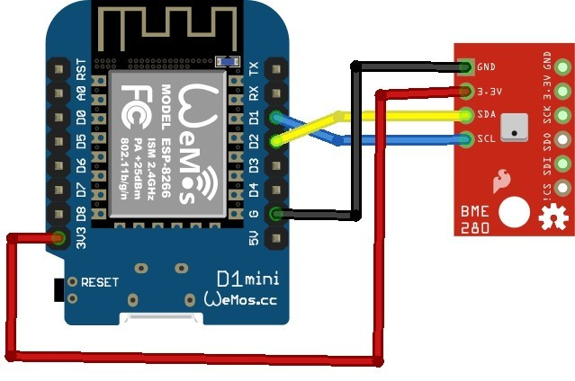

# Using the BME280 Sensor with an ESP8266 Microcontroller

This repository contains easily reusable code to read the [BME280](https://lastminuteengineers.com/bme280-arduino-tutorial/) temperature, pressure and humidity sensor by an ESP8266 microcontroller.


## Wiring

This code was tested on Wemos D1 Mini with the following wiring:



_(Photo from [esp8266learning.com](http://www.esp8266learning.com/esp8266-and-bme280-temperature-sensor-example.php).)_


## Usage

1. Add the `Adafruit BME280 Library` and `Adafruit Unified Sensor` library to your project.

2. Copy the `bme280.cpp` and `bme280.h` files to your project folder.

3. Include the `bme280.h` header file into your project:
```cpp
#include "bme280.h"
```

4. Create an instance of the sensor (uses the default `0x76` address):
```cpp
BME280 bme;
```

5. Initialize the sensor when your device boots up:
```cpp
void setup() {
  bme.init();
}
```

6. Read the sensor values:
```cpp
void loop() {
  BME280::Measurement measurement = bme.getMeasuredData();
}
```

7. Get the temperature, pressure, altitude and humidity values:
```cpp
Serial.printf("Temperature: %.1f *C\n", measurement.temperature);
Serial.printf("Pressure: %.1f hPa\n", measurement.pressure);
Serial.printf("Altitude: %.1f m\n", measurement.altitude);
Serial.printf("Humidity: %.1f %\n", measurement.humidity);
```

For a complete example check the `esp8266-bme280.ino` file.

Optional: you can use the `getTemperature()`, `getPressure()`, `getAltitude()` and `getHumidity()` functions of the `BME280` class individually as well.


## How it works

This `BME280` class acts as a wrapper around the [Adafruit BME280 Library](https://github.com/adafruit/Adafruit_BME280_Library) to provide easier setup, and encapsulate all logic, includes and constants related to this sensor.

Currently this class provides the most frequently used functionality of the sensor, but the sensor provides additional options to further customize its behavior. Check [this example](https://github.com/adafruit/Adafruit_BME280_Library/blob/master/examples/advancedsettings/advancedsettings.ino) to see various scenarios.


## About the author

This project is maintained by [György Balássy](https://linkedin.com/in/balassy).
